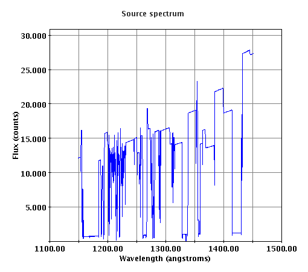
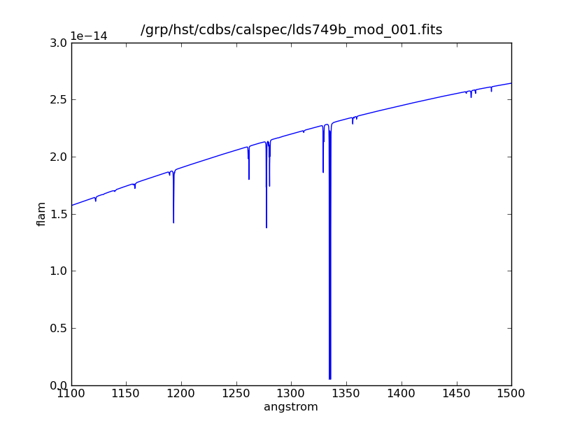
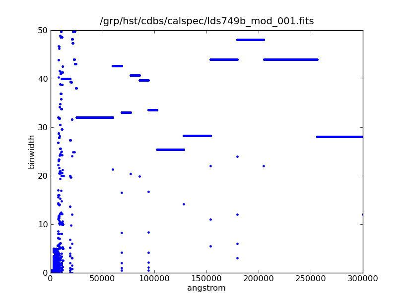
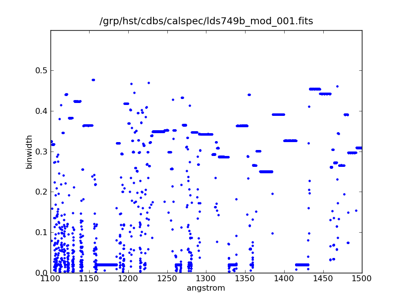
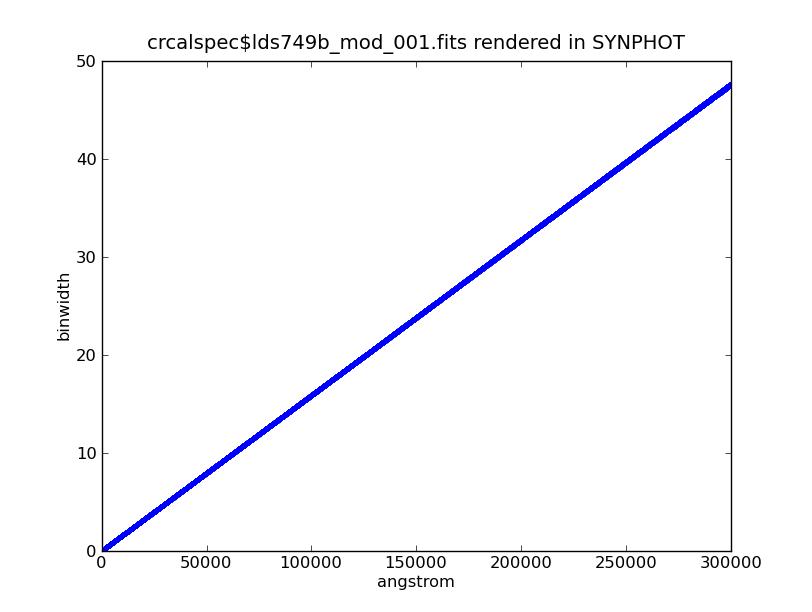
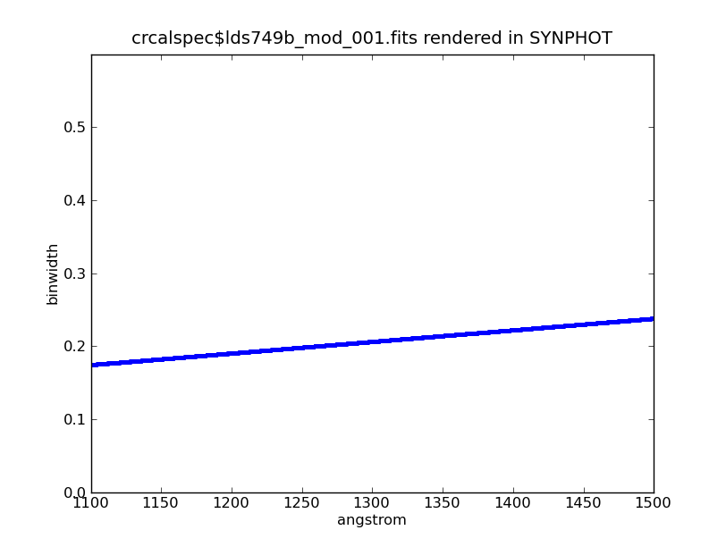
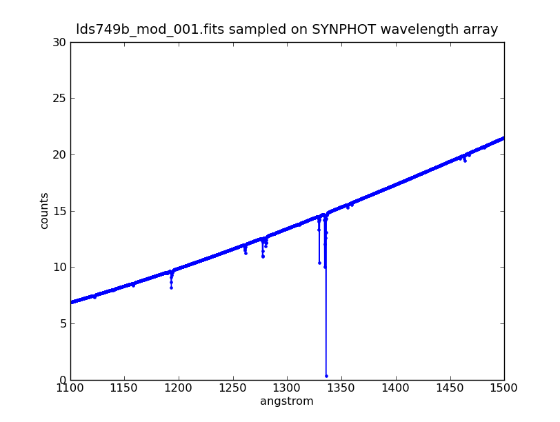

Discovery case
==============

This issue was reported by Cristina Oliveira during user testing of
ETC 18.0 (etc.stsci.edu) on 26 October 2009, for exposure ID COS.A192124
which specifies LDS749B (crcalspec$lds749b_mod_001.fits) as the target spectrum.

   Spectrum, in counts, as rendered in ETC 18.0

She observed that the file in CDBS looked much smoother.

   Corresponding spectrum, in flam, when plotted manually

Investigation
==============

Using pysynphot v0.61, the observed ETC behavior was duplicated. Further
examination of the input spectrum revealed that its wavelength table is
far from evenly spaced. Its bin widths range from 0.00098A to 50A. In the
specific domain of interest (1100A to 1500A), the bin size ranges from 0.00195
to 0.477.

   Scatter plot showing bin width as a function of wavelength

   Scatter plot zoomed to x(1100:1500) and y(0:0.6)

Unlike most of the other units supported by (py)synphot, "counts" is not a
flux density. When a spectrum is plotted in counts, the y value per bin
is obtained by integrating the flux density over the bin width, then converting
that integrated flux into counts. Therefore, the appearance of a plotted
spectrum in counts is critically dependent on the underlying wavelength
array in which it is presented.

This was not apparent in SYNPHOT plots (and, therefore, not in versions of the
ETC which used synphot for plotting) because SYNPHOT uses a logarithmically
spaced wavelength array when combining spectra (and SYNPHOT always combines
spectra with Vega, even if they're just being read in from a file and then
plotted).

   bin width spacing of SYNPHOT spectrum

   SYNPHOT bin width zoomed to x(1100:1500), y(0:0.6)

When pysynphot is used to sample the LDS749b spectrum, in counts, on the
wavelength array used by SYNPHOT, the appearance is  much more "reasonable".

   pysynphot LDS749B spectrum sampled on SYNPHOT wavelength array

Conclusions
===========

The peculiar appearance of the plot is an artifact of the irregular wavelength
array in the spectrum being plotted, and the fact that a spectrum presented
in counts has been integrated over wavelength in each bin.

Presenting a source spectrum in counts is not a useful plot, and the ETC
should probably not be presenting this plot in counts.

This was a useful case study in differences between SYNPHOT and pysynphot
which will be added to the pysynphot documentation for SYNPHOT users.

