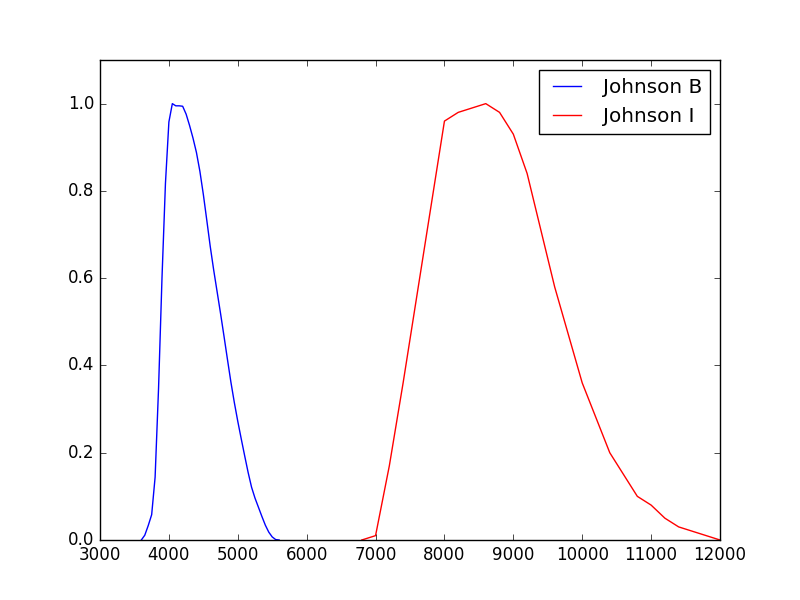

.. doctest-skip-all

.. _bandpass-main:

Bandpass
========

A bandpass can be constructed by one of the following methods:

* Load a supported :ref:`FITS file <synphot-fits-format-overview>` or
  :ref:`ASCII file <synphot-ascii-format-overview>` with
  :meth:`~synphot.spectrum.SpectralElement.from_file`.
* Use a pre-defined filter with
  :meth:`~synphot.spectrum.SpectralElement.from_filter`.
* Pass a :ref:`supported model <synphot_models_overview>` along with the
  keywords needed to define it into a
  :class:`~synphot.spectrum.SpectralElement` object.
* Build a composite bandpass using :ref:`synphot-spec-math-op`.

It has various :ref:`photometric properties <synphot_formulae>` and these
main components:

* ``model``, the underlying Astropy model
* ``waveset``, the wavelength set for optimal sampling
* ``waverange``, the range (inclusive) covered by ``waveset``
* ``meta``, metadata associated with the spectrum
* ``warnings``, special metadata to highlight any warning

To **evaluate** its transmission at a given wavelength, use its
:py:meth:`~object.__call__` method as you would with any Astropy model::

    >>> from astropy import units as u
    >>> from synphot import SpectralElement
    >>> from synphot.models import Box1D
    >>> bp = SpectralElement(Box1D, amplitude=1, x_0=5000, width=100)
    >>> bp(500 * u.nm)
    <Quantity 1.0>

Bandpass also has access to **photometric parameter** calculations akin to
IRAF SYNPHOT ``bandpar`` task. (Also see :ref:`synphot_formulae` and respective
API documentations.) Some of these need the information of telescope collecting
area, which will be set to HST value in the examples below::

    >>> area = 45238.93416 * (u.cm * u.cm)  # HST
    >>> bp.avgwave()
    <Quantity 4999.995000001091 Angstrom>
    >>> bp.tlambda()
    <Quantity 1.0>
    >>> bp.tpeak()
    <Quantity 1.0>
    >>> bp.wpeak()  # For box, this is the first occurence of max throughput
    <Quantity 4950.0 Angstrom>
    >>> bp.efficiency()
    <Quantity 0.020000686709115298>
    >>> bp.equivwidth()
    <Quantity 100.00000000218279 Angstrom>
    >>> bp.rectwidth()
    <Quantity 100.00000000218279 Angstrom>
    >>> bp.rmswidth()
    <Quantity 28.867513315773838 Angstrom>
    >>> bp.photbw()
    <Quantity 28.867032163097033 Angstrom>
    >>> bp.fwhm()
    <Quantity 67.97666597821402 Angstrom>
    >>> bp.pivot()
    <Quantity 4999.911663668414 Angstrom>
    >>> bp.barlam()
    <Quantity 4999.744993503255 Angstrom>
    >>> bp.unit_response(area)
    <Quantity 8.78202683842001e-19 FLAM>
    >>> bp.emflx(area)
    <Quantity 8.782026838611703e-17 FLAM>

To check the **overlap**, i.e., whether the wavelength range of another
spectrum is defined everywhere within the a bandpass, you can use
:meth:`~synphot.spectrum.SpectralElement.check_overlap`, as follows.
This check is useful to test whether convolving the two spectra would result in
any potential inaccurate representation of the result::

    >>> from synphot import SourceSpectrum
    >>> from synphot.models import Empirical1D
    >>> bp = SpectralElement(
    ...     Empirical1D, points=[2999.9, 3000, 6000, 6000.1],
    ...     lookup_table=[0, 1, 1, 0])
    # Source spectrum is fully defined within bandpass waveset
    >>> sp_full = SourceSpectrum(
    ...     Empirical1D, points=[999.9, 1000, 9000, 9000.1],
    ...     lookup_table=[0, 1, 1, 0])
    >>> bp.check_overlap(sp_full)
    'full'
    # 99% of spectrum's flux is in the overlap (not a concern)
    >>> sp_most = SourceSpectrum(
    ...     Empirical1D, points=[3005, 3005.1, 6000.1, 6000.2],
    ...     lookup_table=[0, 1, 1, 0])
    >>> bp.check_overlap(sp_most)
    'partial_most'
    # Source spectrum needs significant extrapolation (guessing)
    >>> sp_notmost = SourceSpectrum(
    ...     Empirical1D, points=[3999.9, 4500.1], lookup_table=[1, 1])
    >>> bp.check_overlap(sp_notmost)
    'partial_notmost'
    # No overlap at all
    >>> sp_none = SourceSpectrum(
    ...     Empirical1D, points=[99.9, 100, 2999.8, 2999.9],
    ...     lookup_table=[0, 1, 1, 0])
    >>> bp.check_overlap(sp_none)
    'none'

.. _synphot-bandpass-arrays:

Arrays
------

Creating bandpass from arrays is recommended when the input file is in a format
that is not supported by **synphot**. You can read the file however you like
using another package and store the wavelength and throughput as arrays to be
processed by **synphot** as an empirical model.

The example below creates and plots a bandpass from some given arrays. It also
demonstrates that you can choose to keep negative throughput values (however
unrealistic), if desired:

.. plot::
    :include-source:

    from synphot import SpectralElement
    from synphot.models import Empirical1D
    wave = [999, 1000, 2000, 3000, 3001]  # Angstrom
    thru = [0, 0.1, -0.2, 0.3, 0]
    bp = SpectralElement(
        Empirical1D, points=wave, lookup_table=thru, keep_neg=True)
    bp.plot()
    plt.axhline(0, color='k', ls=':')

.. _synphot-box-bandpass:

Box
---

A box-shaped bandpass is a rectangular window centered on a given wavelength
with a given width. It is defined as:

.. math::

    f(x) = \left \{
             \begin{array}{ll}
               1   & : x_0 - w/2 \geq x \geq x_0 + w/2 \\
               0   & : \text{else}
             \end{array}
           \right.

where

* :math:`f(x)` is the throughput
* :math:`x_{0}` is the central wavelength
* :math:`x` is the wavelength array
* :math:`w` is the width of the box

The example below creates and plots a box-shaped bandpass centered at
600 nm with a width of 10 nm:

.. plot::
    :include-source:

    import matplotlib.pyplot as plt
    from astropy import units as u
    from synphot import SpectralElement
    from synphot.models import Box1D
    bp = SpectralElement(Box1D, amplitude=1, x_0=600*u.nm, width=10*u.nm)
    # Plot at user unit instead of internal unit
    bp.plot(wavelengths=bp.waveset.to(u.nm), top=1.1, title='Box Bandpass')
    plt.axvline(600, ls='--', color='k')

.. _synphot-bandpass-from-file:

File
----

A bandpass can also be defined using a FITS or ASCII table containing columns
of wavelength and throughput. See :ref:`synphot-fits-format-overview` and
:ref:`synphot-ascii-format-overview` for details on how to create such tables.

The example below loads and plots a bandpass from FITS table in the software
test data directory:

.. plot::
    :include-source:

    import os
    from astropy.utils.data import get_pkg_data_filename
    from synphot import SpectralElement
    filename = get_pkg_data_filename(
        os.path.join('data', 'hst_acs_hrc_f555w.fits'),
        package='synphot.tests')
    bp = SpectralElement.from_file(filename)
    bp.plot(left=4000, right=7000)

.. _synphot-predefined-filter:

Filter
------

Pre-defined bandpass for some common filters are provided for convenience.
(See :ref:`synphot-installation-setup` for instructions on how to obtain the
data files.) They can be accessed via
:meth:`~synphot.spectrum.SpectralElement.from_filter` by passing in the
appropriate filter names:

* ``'bessel_j'`` (Bessel *J*)
* ``'bessel_h'`` (Bessel *H*)
* ``'bessel_k'`` (Bessel *K*)
* ``'cousins_r'`` (Cousins *R*)
* ``'cousins_i'`` (Cousins *I*)
* ``'johnson_u'`` (Johnson *U*)
* ``'johnson_b'`` (Johnson *B*)
* ``'johnson_v'`` (Johnson *V*)
* ``'johnson_r'`` (Johnson *R*)
* ``'johnson_i'`` (Johnson *I*)
* ``'johnson_j'`` (Johnson *J*)
* ``'johnson_k'`` (Johnson *K*)

The example below loads and plots bandpasses from Johnson *BI*::

    >>> import matplotlib.pyplot as plt
    >>> from synphot import SpectralElement
    >>> b = SpectralElement.from_filter('johnson_b')
    >>> i = SpectralElement.from_filter('johnson_i')
    >>> plt.plot(b.waveset, b(b.waveset), 'b', i.waveset, i(i.waveset), 'r')
    >>> plt.ylim(0, 1.1)
    >>> # Label comes from DESCRIP keyword from FITS header
    >>> plt.legend([b.meta['header']['descrip'], i.meta['header']['descrip']])

.. _synphot-bandpass-uniform:

Flat
----

A flat (uniform) bandpass has a constant throughput at any wavelength value.
It is defined as:

.. math::

    f(x) = A

where

* :math:`f(x)` is the throughput
* :math:`x` is the wavelength array
* :math:`A` is the constant

The example below creates and plots a flat bandpass with its transmission
set at 0.8:

.. plot::
    :include-source:

    from astropy.modeling.models import Const1D
    from synphot import SpectralElement
    bp = SpectralElement(Const1D, amplitude=0.8)
    bp.plot([1000, 10000], title='Flat Bandpass')
