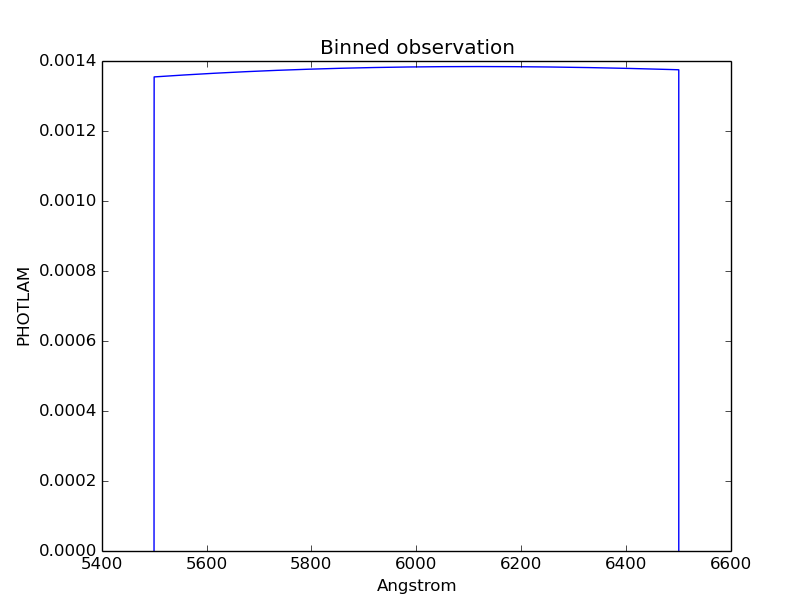

.. doctest-skip-all

.. _synphot_observation:

Observation
===========

An `~synphot.observation.Observation` combines a source spectrum and a bandpass.
It is usually the end-point of a chain of spectral manipulation.

It has similar properties and methods as a source spectrum
(see :ref:`synphot-source-create`), except that irrelevant methods
(e.g., tapering) and properties (e.g., redshift) are disabled. It also has some
extra functionalities that are specific to an observation
(e.g., detector pixel binning, and effective wavelength and stimulus).

Examples
--------

Setting up an observation of a blackbody at 6000 K through a box-shaped
bandpass, ignoring the rest of the telescope optics:

>>> from synphot import SourceSpectrum, SpectralElement, Observation
>>> from modeling import models  # Has to support composite model and sampleset
>>> obs = Observation(
...     SourceSpectrum.from_blackbody(6000),
...     SpectralElement(models.Box1D, amplitude=1, x_0=6000, width=1000))
>>> obs.spectrum
<synphot.spectrum.SourceSpectrum at 0x321db90>
>>> obs.bandpass
<synphot.spectrum.SpectralElement at 0x321dd10>
>>> obs.plot(binned=True, title='Binned observation')

By default, bin centers (``binset``) are extracted from bandpass ``waveset``,
if available. Bin edges and binned flux are then calculated from the bin
centers. They are not evaluated at ``__call__`` like the native dataset
because they are not a continuous function. For that reason also, sampling
binned data can only be done at bin centers:

>>> obs.bandpass.waveset
<Quantity [ 5499.99      , 5500.        , 5500.01      ,...,
            6499.99000002, 6500.00000002, 6500.01000002] Angstrom>
>>> obs.binset
<Quantity [ 5499.99      , 5500.        , 5500.01      ,...,
            6499.99000002, 6500.00000002, 6500.01000002] Angstrom>
>>> obs.bin_edges
<Quantity [ 5499.985     , 5499.995     , 5500.005     ,...,
            6499.99500002, 6500.00500002, 6500.01500002] Angstrom>
>>> obs.binflux
<Quantity [ 0.        , 0.00101533, 0.00135377,...,  0.00137422,
            0.00034355, 0.        ] PHOTLAM>
>>> obs.sample_binned(wavelengths=[5500, 6500])
<Quantity [ 0.00101533, 0.00034355] PHOTLAM>
>>> obs.sample_binned(wavelengths=4000)
InterpolationNotAllowed: Some or all wavelength values are not in binset.

To calculate the wavelength range for binned dataset for a given central
wavelength and number of pixels:

>>> obs.binned_waverange(6000, 100)
<Quantity [ 5999.49500001, 6000.49500001] Angstrom>

To calculate the number of pixels within the given wavelength range for binned
data:

>>> obs.binned_pixelrange([5500, 5501])
99

The only math operation available for an observation is multiplication, which
behaves like `~synphot.spectrum.SourceSpectrum`
(see :ref:`synphot-spec-math-op`), except that a new observation is created
with existing ``binset`` and ``force`` option:

>>> obs2 = obs * 2
>>> obs2.sample_binned(wavelengths=[5500, 6500])
<Quantity [ 0.00203066, 0.00068711] PHOTLAM>

The following (see :ref:`synphot_formulae`) can be calculated but only available
for native dataset:

>>> from astropy import units as u
>>> obs.integrate()
<Quantity 1.376311746506425 PHOTLAM>
>>> obs.avgwave()
<Quantity 6001.136682969507 Angstrom>
>>> obs.barlam()
<Quantity 5980.340264024184 Angstrom>
>>> obs.pivot()
<Quantity 5994.200092136247 Angstrom>
>>> obs_norm = obs.normalize(1 * u.mJy)
>>> obs_norm.integrate()
<Quantity 16.420941494498578 PHOTLAM>

The :ref:`effective wavelength <synphot-formula-effwave>` of an observation is
calculated using binned dataset by default. As per ASTROLIB PYSYNPHOT, flux is
first converted to FLAM prior to calculation:

>>> obs.effective_wavelength()
<Quantity 6001.139160552627 Angstrom>

The :ref:`effective stimulus <synphot-formula-effstim>` of an observation is
calculated in PHOTLAM using native dataset by default:

>>> obs.effstim()
<Quantity 0.0013765736319723961 PHOTLAM>
>>> obs.effstim(flux_unit=u.Jy)
<Quantity 0.00548642093772285 Jy>

Count rate of an observation is a special form of effective stimulus. As per
ASTROLIB PYSYNPHOT, it is calculated using binned dataset by default and
requires telescope collecting area:

>>> area = 45238.93416 * (u.cm * u.cm)  # HST
>>> obs.countrate(area)
<Quantity 62262.87879638469 ct / s>

An observation can be reduced to a simple empirical source spectrum, which takes
up less memory and has some functionalities that observation does not
(e.g., writing to FITS, redshift, and tapering). By default, binned dataset is
used:

>>> spec = obs.as_spectrum()
>>> spec
<synphot.spectrum.SourceSpectrum at 0x4872210>
>>> spec.z
0.0
