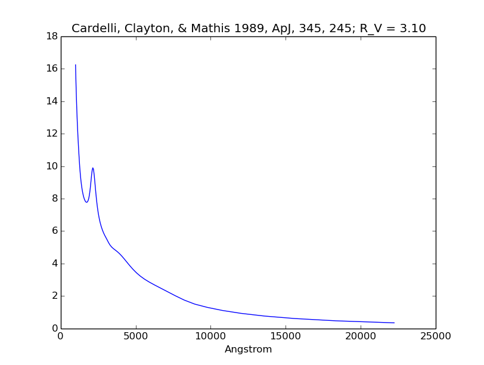
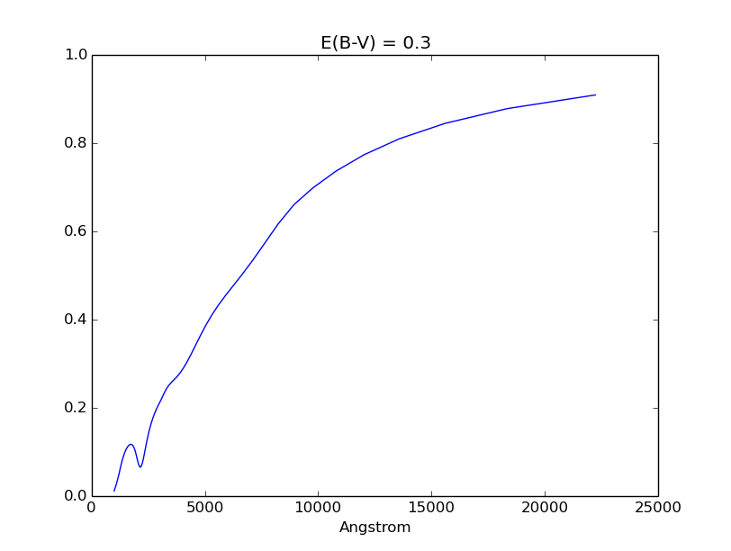

.. doctest-skip-all

.. _synphot_reddening:

Reddening and Extinction
========================

Extinction in ``synphot`` is defined as:

.. math::

    R(V) = \frac{A(V)}{E(B-V)}

Below are the pre-defined extinction models. By default, they are downloaded
from STScI as defined in ``synphot.config``. They can be accessed via
:func:`~synphot.reddening.ReddeningLaw.from_extinction_model` by providing the
following model names:

========== ===================================== =========================== ==== =================================================================
Model name Config Item                           Description                 R(V) Reference
========== ===================================== =========================== ==== =================================================================
'lmc30dor' ``synphot.config.conf.lmc30dor_file`` LMC2 Supershell             2.76 :ref:`Gordon et al. 2003 <synphot-ref-extinction-gordon2003>`
'lmcavg'   ``synphot.config.conf.lmcavg_file``   LMC Average                 3.41 :ref:`Gordon et al. 2003 <synphot-ref-extinction-gordon2003>`
'mwavg'    ``synphot.config.conf.mwavg_file``    Milky Way Diffuse           3.1  :ref:`Cardelli et al. 1989 <synphot-ref-extinction-cardelli1989>`
'mwdense'  ``synphot.config.conf.mwdense_file``  Milky Way Dense             5.0  :ref:`Cardelli et al. 1989 <synphot-ref-extinction-cardelli1989>`
'mwrv21'   ``synphot.config.conf.mwrv21_file``   Milky Way CCM               2.1  :ref:`Cardelli et al. 1989 <synphot-ref-extinction-cardelli1989>`
'mwrv40'   ``synphot.config.conf.mwrv40_file``   Milky Way CCM               4.0  :ref:`Cardelli et al. 1989 <synphot-ref-extinction-cardelli1989>`
'smcbar'   ``synphot.config.conf.smcbar_file``   SMC Bar                     2.74 :ref:`Gordon et al. 2003 <synphot-ref-extinction-gordon2003>`
'xgalsb'   ``synphot.config.conf.xgal_file``     Starburst (attenuation law) 4.0  :ref:`Calzetti et al. 2000 <synphot-ref-extinction-calzetti2000>`
========== ===================================== =========================== ==== =================================================================

`~synphot.reddening.ReddeningLaw` has similar properties and methods as a
unitless spectrum (`~synphot.spectrum.BaseUnitlessSpectrum`). Besides
pre-defined models above, it can also read/write from/to files as described in
:ref:`synphot-io`.

When :math:`E(B-V)` is given, its
:func:`~synphot.reddening.ReddeningLaw.extinction_curve` method can produce
`~synphot.reddening.ExtinctionCurve` (also a unitless spectrum), which can then
be multiplied to a source spectrum as desired.

Examples
--------

>>> from synphot import ReddeningLaw
>>> rlaw = ReddeningLaw.from_extinction_model('mwavg', encoding='binary')
Downloading ftp://ftp.stsci.edu/cdbs/extinction/milkyway_diffuse_001.fits
|===========================================| 8.6k/8.6k (100.00%)        00s
>>> rlaw.plot(title=rlaw.metadata['descrip'])

>>> extcurve = rlaw.extinction_curve(0.3)
>>> extcurve
<synphot.reddening.ExtinctionCurve at 0x38f0890>
>>> extcurve.plot(title='E(B-V) = 0.3')

