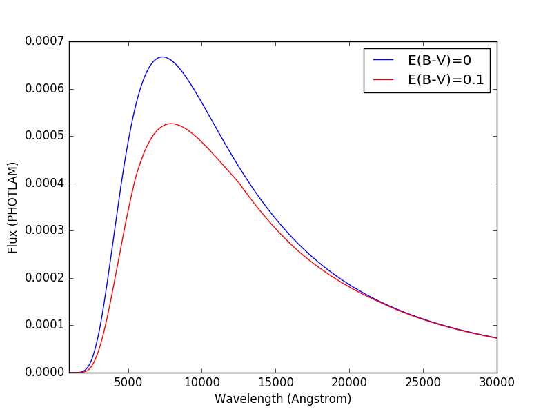
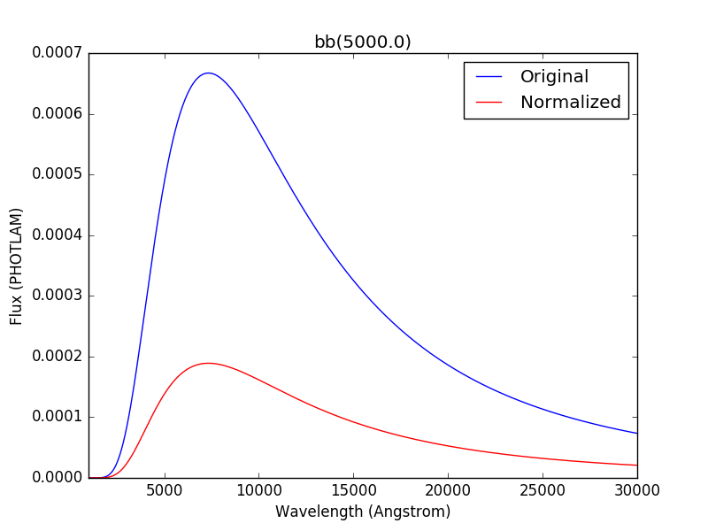
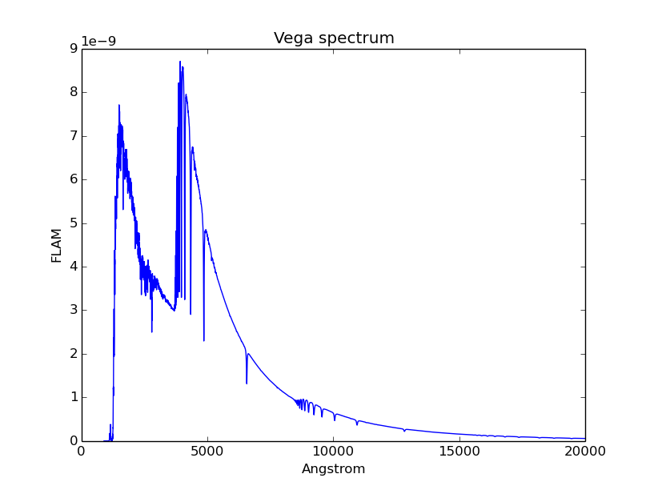

.. doctest-skip-all

.. _source-spectrum-main:

Source Spectrum
===============

A source spectrum is used to represent astronomical sources, such as stars and
galaxies. An :ref:`synphot_observation` is a special case of a
source spectrum that is convolved with a :ref:`bandpass-main`.

A source spectrum can be constructed by one of the following methods:

* Load a supported :ref:`FITS file <synphot-fits-format-overview>` or
  :ref:`ASCII file <synphot-ascii-format-overview>` with
  :meth:`~synphot.spectrum.SourceSpectrum.from_file`.
* Use the pre-defined Vega spectrum, which is also used to define VEGAMAG, with
  :meth:`~synphot.spectrum.SourceSpectrum.from_vega`.
* Pass a :ref:`supported model <synphot_models_overview>` along with the
  keywords needed to define it into a
  :class:`~synphot.spectrum.SourceSpectrum` object.
* Create a thermal source spectrum with
  :meth:`~synphot.thermal.ThermalSpectralElement.thermal_source`.
* Build a composite source using :ref:`synphot-spec-math-op`.
  (Also see example in :ref:`synphot_getting_started`.)

It has these main components:

* ``z``, the redshift applied, if any
* ``z_type`` that indicates whether redshift also conserves flux or not
* ``model``, the underlying Astropy model
* ``waveset``, the wavelength set for optimal sampling
* ``waverange``, the range (inclusive) covered by ``waveset``
* ``meta``, metadata associated with the spectrum
* ``warnings``, special metadata to highlight any warning

To **evaluate** its flux at a given wavelength, use its
:py:meth:`~object.__call__` method as you would with any Astropy model
(except that the method also takes additional keywords like ``flux_unit``
for flux conversion)::

    >>> from synphot import SourceSpectrum, units
    >>> from synphot.models import ConstFlux1D
    >>> sp = SourceSpectrum(ConstFlux1D, amplitude=1)  # PHOTLAM
    >>> wave = [1000, 10000]  # Angstrom
    >>> sp(wave)
    <Quantity [ 1., 1.] PHOTLAM>
    >>> sp(wave, flux_unit=units.FNU)
    <Quantity [  6.62606957e-24,  6.62606957e-23] FNU>
    >>> area = 45238.93416 * units.AREA  # HST
    >>> sp(wave, flux_unit=units.OBMAG, area=area)
    <Quantity [-21.52438718,-21.52438718] OBMAG>

.. _synphot_reddening:

To apply (or remove) the effects of interstellar **reddening** on a source
spectrum, use :meth:`~synphot.reddening.ReddeningLaw.from_extinction_model`
to provide a reddening model name (see table below; not to be confused with
Astropy model) and then
:meth:`~synphot.reddening.ReddeningLaw.extinction_curve` to create the
extinction curve with a given :math:`E(B-V)` value (negative value effectively
de-reddens the spectrum), and then multiply it to the source::

    >>> import matplotlib.pyplot as plt
    >>> from synphot import SourceSpectrum, ReddeningLaw
    >>> from synphot.models import BlackBodyNorm1D
    >>> em = SourceSpectrum(BlackBodyNorm1D, temperature=5000)
    >>> ext = ReddeningLaw.from_extinction_model(
    ...     'lmcavg').extinction_curve(0.1)
    >>> sp = em * ext
    >>> wave = em.waveset
    >>> plt.plot(wave, em(wave), 'b', wave, sp(wave), 'r')
    >>> plt.xlim(1000, 30000)
    >>> plt.xlabel('Wavelength (Angstrom)')
    >>> plt.ylabel('Flux (PHOTLAM)')
    >>> plt.legend(['E(B-V)=0', 'E(B-V)=0.1'], loc='upper right')

+--------+---------------------------+------------+
|Name    |Description                |Reference   |
+========+===========================+============+
|mwavg   |Milky Way Diffuse, R(V)=3.1||mw_ext_ref||
+--------+---------------------------+            |
|mwdense |Milky Way Dense, R(V)=5.0  |            |
+--------+---------------------------+            |
|mwrv21  |Milky Way CCM, R(V)=2.1    |            |
+--------+---------------------------+            |
|mwrv4   |Milky Way CCM, R(V)=4.0    |            |
+--------+---------------------------+------------+
|lmc30dor|LMC Supershell, R(V)=2.76  ||mc_ext_ref||
+--------+---------------------------+            |
|lmcavg  |LMC Average, R(V)=3.41     |            |
+--------+---------------------------+            |
|smcbar  |SMC Bar, R(V)=2.74         |            |
+--------+---------------------------+------------+
|xgalsb  |Starburst, R(V)=4.0        ||xg_ext_ref||
|        |(attenuation law)          |            |
+--------+---------------------------+------------+

.. |mw_ext_ref| replace:: :ref:`Cardelli et al. (1989) <synphot-ref-extinction-cardelli1989>`
.. |mc_ext_ref| replace:: :ref:`Gordon et al. (2003) <synphot-ref-extinction-gordon2003>`
.. |xg_ext_ref| replace:: :ref:`Calzetti et al. (2000) <synphot-ref-extinction-calzetti2000>`

For extinction due to Lyman-alpha forest, see :ref:`tutorial_lyman_alpha`
tutorial.

You can **redshift** a source spectrum in several ways (shown in example
below), either by setting its ``z`` attribute or passing in a ``z`` keyword
during initialization. To blueshift, you may use the same attribute/keyword but
set its *value* to :math:`\frac{1}{1 + z} - 1` instead. By default, only
the wavelength values are shifted, not the flux (i.e., total flux is not
preserved):

.. plot::
    :include-source:

    import matplotlib.pyplot as plt
    from synphot import SourceSpectrum
    from synphot.models import BlackBodyNorm1D
    fig, ax = plt.subplots(3, sharex=True)
    # Create a source at rest wavelength and sample it because it will
    # be modified in-place below
    sp_rest = SourceSpectrum(BlackBodyNorm1D, temperature=5000)
    wave = range(2500, 25000, 10)
    flux = sp_rest(wave)
    # Redshift the original source as a new spectrum
    sp_z1 = SourceSpectrum(sp_rest.model, z=0.1)
    ax[0].plot(wave, flux, 'b--', wave, sp_z1(wave), 'r')
    # Redshift the original source in-place
    sp_rest.z = 0.1
    ax[1].plot(wave, flux, 'b--', wave, sp_rest(wave), 'r')
    # Create a redshifted source from scratch
    sp_z2 = SourceSpectrum(BlackBodyNorm1D, temperature=5000, z=0.1)
    ax[2].plot(wave, flux, 'b--', wave, sp_z2(wave), 'r')
    # Extra plot commands
    ax[2].set_xlim(2500, 25000)
    ax[2].set_xlabel('Wavelength (Angstrom)')
    ax[1].set_ylabel('Flux (PHOTLAM)')
    ax[0].legend(['z=0', 'z=0.1'], loc='upper right')

You can also **redshift while preserving flux** by setting ``z_type`` to
``'conserve_flux'``:

.. plot::
    :include-source:

    import matplotlib.pyplot as plt
    from synphot import SourceSpectrum
    from synphot.models import BlackBodyNorm1D
    # Create a source at rest wavelength
    sp_rest = SourceSpectrum(BlackBodyNorm1D, temperature=5000)
    # Redshift the original source and conserve flux
    sp_z1 = SourceSpectrum(sp_rest.model, z=0.1, z_type='conserve_flux')
    # Plot them
    wave = range(2500, 25000, 10)
    plt.plot(wave, sp_rest(wave), 'b--', wave, sp_z1(wave), 'r')
    plt.xlim(2500, 25000)
    plt.xlabel('Wavelength (Angstrom)')
    plt.ylabel('Flux (PHOTLAM)')
    plt.legend(['z=0', 'z=0.1'], loc='upper right')

A source spectrum can also be **normalized** to a given flux value in a given
bandpass using its :meth:`~synphot.spectrum.BaseSourceSpectrum.normalize`
method. The resultant spectrum is basically the source multiplied with a factor
necessary to achieve the desired normalization::

    >>> import matplotlib.pyplot as plt
    >>> from synphot import SourceSpectrum, SpectralElement, units
    >>> from synphot.models import BlackBodyNorm1D
    >>> sp = SourceSpectrum(BlackBodyNorm1D, temperature=5000)
    >>> bp = SpectralElement.from_filter('johnson_v')
    >>> vega = SourceSpectrum.from_vega()  # For unit conversion
    >>> sp_norm = sp.normalize(17 * units.VEGAMAG, bp, vegaspec=vega)
    >>> wave = sp.waveset
    >>> plt.plot(wave, sp(wave), 'b', wave, sp_norm(wave), 'r')
    >>> plt.xlim(1000, 30000)
    >>> plt.xlabel('Wavelength (Angstrom)')
    >>> plt.ylabel('Flux (PHOTLAM)')
    >>> plt.title(sp.meta['expr'])
    >>> plt.legend(['Original', 'Normalized'], loc='upper right')

**Integration** is done with the
:meth:`~synphot.spectrum.BaseSpectrum.integrate`
method. It uses trapezoid integration (but could be expanded to perform
analytical calculations instead in the future when that is supported by
Astropy). By default, integration is done in internal units::

    >>> from synphot import SourceSpectrum, units
    >>> from synphot.models import GaussianFlux1D
    >>> sp = SourceSpectrum(GaussianFlux1D, mean=6000, fwhm=10,
    ...                     total_flux=1*u.erg/(u.cm**2 * u.s))
    >>> sp.integrate()
    <Quantity 3.02046763e+11 ph / (cm2 s)
    >>> sp.integrate(flux_unit=units.FLAM)
    <Quantity 0.99999972 erg / (cm2 s)>

.. _synphot-empirical-source:

Arrays
------

Creating source spectrum from arrays is recommended when the input file is in
a format that is not supported by **synphot**. You can read the file however
you like using another package and store the wavelength and flux as arrays to
be processed by **synphot** as an empirical model.

The example below creates and plots a source from some given arrays. It also
demonstrates that you can choose to keep negative flux values (however
unrealistic), if desired:

.. plot::
    :include-source:

    from synphot import SourceSpectrum, units
    from synphot.models import Empirical1D
    wave = [1000, 2000, 3000, 4000, 5000]  # Angstrom
    flux = [1e-17, -2.3e-18, 1.8e-17, 4.5e-17, 9e-18] * units.FLAM
    sp = SourceSpectrum(
        Empirical1D, points=wave, lookup_table=flux, keep_neg=True)
    sp.plot(flux_unit=units.FLAM)
    plt.axhline(0, color='k', ls=':')

.. _synphot-planck-law:

Blackbody Radiation
-------------------

Blackbody radiation is defined by Planck's law
(:ref:`Rybicki & Lightman 1979 <synphot-ref-rybicki1979>`):

.. math::

    B_{\lambda}(T) = \frac{2 h c^{2} / \lambda^{5}}{\exp(h c / \lambda k T) - 1}

where the unit of :math:`B_{\lambda}(T)` is
:math:`erg \; s^{-1} cm^{-2} \mathring{A}^{-1} sr^{-1}`
(i.e., FLAM per steradian).

:class:`~synphot.models.BlackBodyNorm1D` generates a blackbody
spectrum in PHOTLAM for a given temperature, normalized to a star of 1 solar
radius at a distance of 1 kpc.
This is to be consistent with ASTROLIB PYSYNPHOT.

The example below creates and plots a blackbody source at 5777 K:

.. plot::
    :include-source:

    import matplotlib.pyplot as plt
    from synphot import SourceSpectrum
    from synphot.models import BlackBodyNorm1D
    sp = SourceSpectrum(BlackBodyNorm1D, temperature=5777)
    sp.plot(flux_unit='flam', title=sp.meta['expr'])
    plt.axvline(sp.model.lambda_max, ls=':')

.. _synphot-source-from-file:

File
----

A source spectrum can also be defined using a FITS or ASCII table containing
columns of wavelength and flux. See :ref:`synphot-fits-format-overview` and
:ref:`synphot-ascii-format-overview` for details on how to create such tables.

The example below loads and plots a source spectrum from FITS table in the
software test data directory:

.. plot::
    :include-source:

    import os
    from astropy.utils.data import get_pkg_data_filename
    from synphot import SourceSpectrum
    filename = get_pkg_data_filename(
        os.path.join('data', 'hst_acs_hrc_f555w_x_grw70d5824.fits'),
        package='synphot.tests')
    sp = SourceSpectrum.from_file(filename)
    sp.plot(left=4000, right=7000)

.. _synphot-flat-spec:

Flat
----

.. math::

    f(x) = A

A flat (uniform) spectrum has a constant flux value in the given flux unit,
except the following, as per ASTROLIB PYSYNPHOT:

* STMAG - Constant value in the unit of FLAM.
* ABMAG - Constant value in the unit of FNU.

These are currently unsupported:

* count
* OBMAG

Note that flux that is constant in a given unit might not be constant in
another (see example below). Such a model has no ``waveset`` defined
(i.e., no clear wavelength constraints on where the feature of interest lies).
Therefore, wavelength values must be explicitly provided for sampling and
plotting.

The example below creates and plots a flat source with the amplitude of
18 ABMAG and shows that it is not flat in STMAG:

.. plot::
    :include-source:

    import matplotlib.pyplot as plt
    from astropy import units as u
    from synphot import SourceSpectrum
    from synphot.models import ConstFlux1D
    sp = SourceSpectrum(ConstFlux1D, amplitude=18*u.ABmag)
    wave = range(10, 26000, 10)
    plt.plot(wave, sp(wave, flux_unit=u.ABmag), 'b',
             wave, sp(wave, flux_unit=u.STmag), 'r--')
    plt.xlim(10, 26000)
    plt.ylim(12, 22)
    plt.ylabel('Flux (mag)')
    plt.xlabel('Wavelength (Angstrom)')
    plt.title('Flat spectrum in ABMAG')
    plt.legend(['ABMAG', 'STMAG'], loc='lower right')

.. _synphot-gaussian-abs:

Gaussian Absorption
-------------------

There are two ways to create a Gaussian absorption feature;
You can choose whichever method that better suits your needs.
One is to first create :ref:`synphot-gaussian` and then subtract it from
a continuum (e.g., :ref:`synphot-flat-spec`):

.. plot::
    :include-source:

    from synphot import SourceSpectrum
    from synphot.models import GaussianFlux1D, ConstFlux1D
    em = SourceSpectrum(GaussianFlux1D, mean=6000, fwhm=10,
                        total_flux=3.3e-12*u.erg/(u.cm**2 * u.s))
    bg = SourceSpectrum(ConstFlux1D, amplitude=2)
    sp = bg - em
    sp.plot()

The other way is to create a unitless absorption profile and then multiply it
to a continuum (e.g., :ref:`synphot-flat-spec`):

.. plot::
    :include-source:

    from astropy.stats.funcs import gaussian_fwhm_to_sigma
    from synphot import SourceSpectrum, BaseUnitlessSpectrum
    from synphot.models import GaussianAbsorption1D, ConstFlux1D
    sig = 10 * gaussian_fwhm_to_sigma
    ab = BaseUnitlessSpectrum(GaussianAbsorption1D, mean=6000, stddev=sig,
                              amplitude=0.047)
    bg = SourceSpectrum(ConstFlux1D, amplitude=2)
    sp = bg * ab
    sp.plot()

.. _synphot-gaussian:

Gaussian Emission
-----------------

.. math::

    f(x) = A \; e^{- \frac{\left(x - x_{0}\right)^{2}}{2 \; \sigma^{2}}}

    \sigma = \frac{\text{FWHM}}{2 \; \sqrt{2 \; \ln 2}}

    A = \frac{f_{\text{tot}}}{\sqrt{2 \; \pi} \; \sigma}

where :math:`f_{\text{tot}}` is the desired total flux.

:class:`~synphot.models.GaussianFlux1D` generates a Gaussian emission spectrum
using input values (central wavelength, FWHM, and total flux) that are somewhat
consistent with ASTROLIB PYSYNPHOT.

The example below creates and plots a Gaussian source centered at 1.8 micron
with FWHM of 200 nm and the given total flux. As stated in
:ref:`synphot_overview`, conversion to internal units happen behind the scenes:

.. plot::
    :include-source:

    from astropy import units as u
    from synphot import SourceSpectrum
    from synphot.models import GaussianFlux1D
    sp = SourceSpectrum(GaussianFlux1D, mean=1.8*u.micron, fwhm=200*u.nm,
                        total_flux=1e-26*u.W/(u.m**2))
    sp.plot(title=sp.meta['expr'])

.. _synphot-powerlaw:

Powerlaw
--------

.. math::

    f(x) = A \; (x / x_{0})^{-\alpha}

where *A* should be set to 1 if you want to be consistent with
ASTROLIB PYSYNPHOT.

:class:`~synphot.models.PowerLawFlux1D` generates a powerlaw source spectrum.
Such a model has no ``waveset`` defined (i.e., no clear wavelength constraints
on where the feature of interest lies). Therefore, wavelength values must be
explicitly provided for sampling and plotting.

The example below creates and plots a powerlaw source with a reference
wavelength of 1 micron and an index of -2:

.. plot::
    :include-source:

    import matplotlib.pyplot as plt
    from astropy import units as u
    from synphot import SourceSpectrum
    from synphot.models import PowerLawFlux1D
    sp = SourceSpectrum(PowerLawFlux1D, amplitude=1, x_0=1*u.micron, alpha=2)
    wave = range(100, 100000, 50) * u.AA
    sp.plot(wavelengths=wave, xlog=True, ylog=True, bottom=0.1, top=1000)
    plt.axvline(sp.model.x_0, color='k', ls='--')  # Ref wave
    plt.axhline(sp.model.amplitude, color='k', ls='--')  # Ref flux

.. _synphot_thermal:

Thermal
-------

`~synphot.thermal.ThermalSpectralElement` handles a spectral element with
thermal properties, which is important in infrared observations.
Its :meth:`~synphot.thermal.ThermalSpectralElement.thermal_source` method
produces a thermal (blackbody) source spectrum. This is usually not used
directly, but rather as part of the calculations for thermal background for
some instrument.
See **stsynphot** documentation regarding "thermal background" for more details.

.. _synphot-vega-spec:

Vega
----

**synphot** uses built-in Vega spectrum for VEGAMAG calculations.
It is loaded from ``synphot.conf.vega_file`` using
:meth:`~synphot.spectrum.SourceSpectrum.from_vega`.

The example below loads and plots the built-in Vega spectrum::

    >>> from synphot import SourceSpectrum
    >>> sp = SourceSpectrum.from_vega()
    >>> sp.plot(right=12000, flux_unit='flam', title=sp.meta['expr'])

