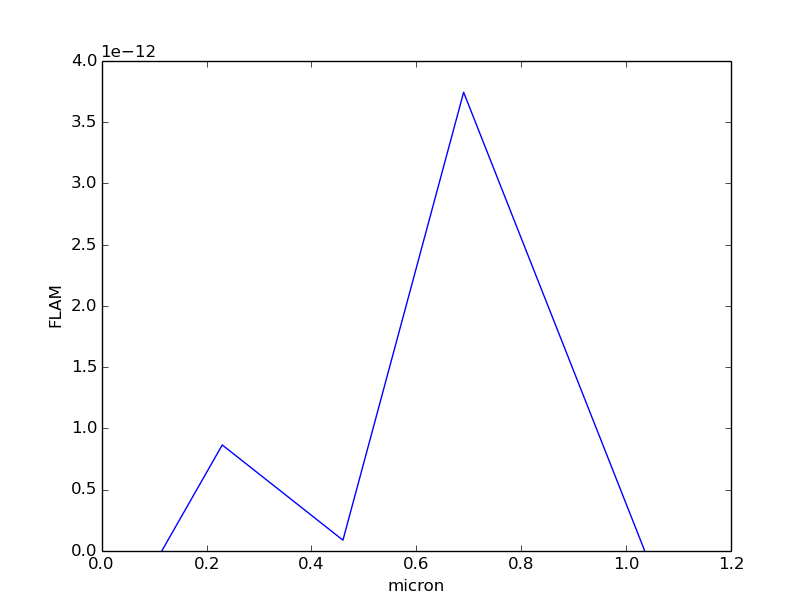
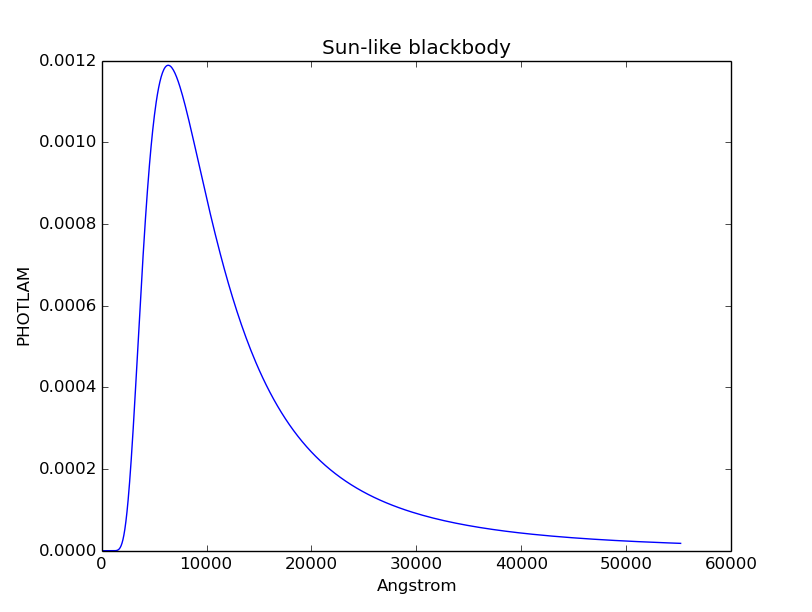
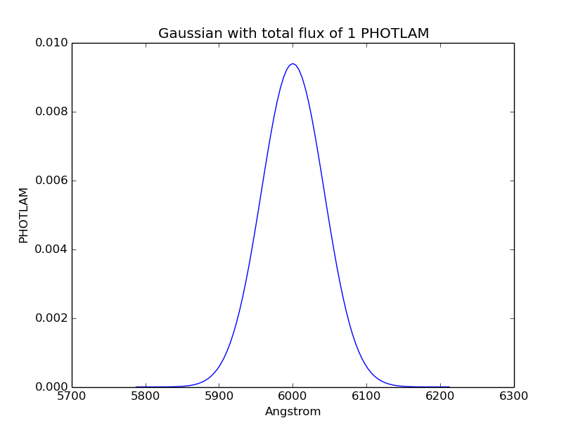
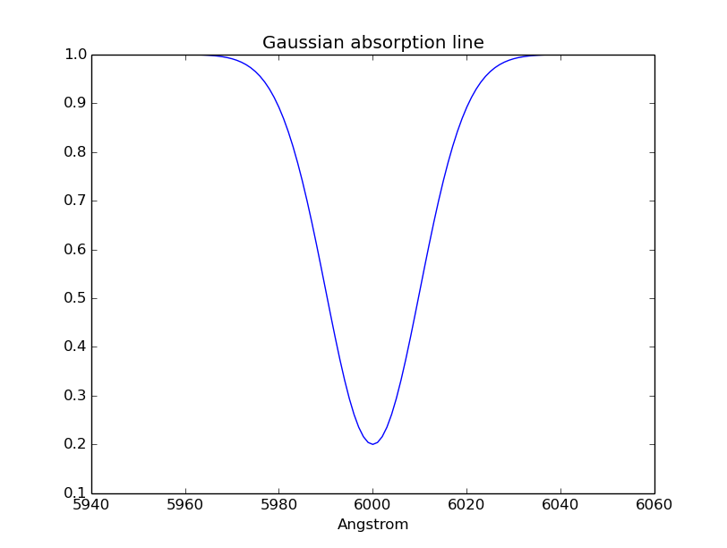
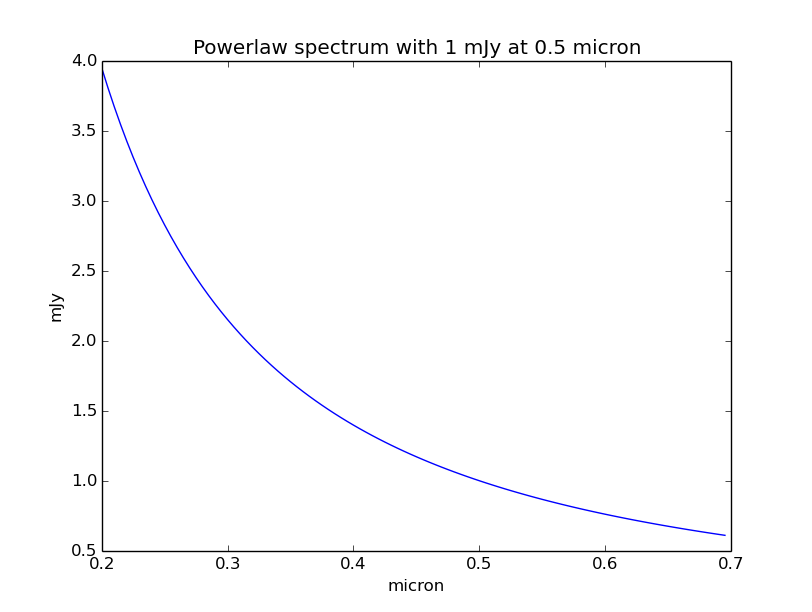
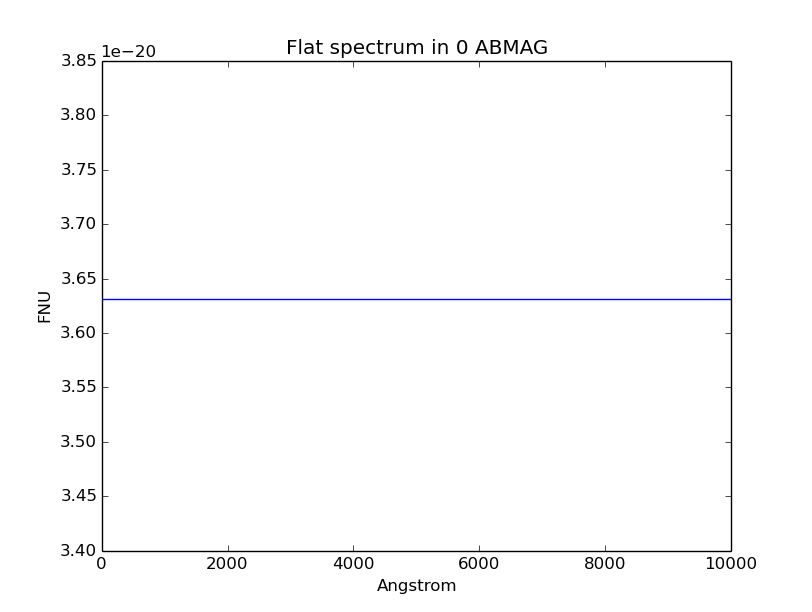

.. doctest-skip-all

.. _source-spectrum-main:

Source Spectrum
===============

Load a `~synphot.spectrum.SourceSpectrum` from file:

>>> from synphot import SourceSpectrum
>>> sp = SourceSpectrum.from_file('/my/path/my_spec.fits')

Construct a spectrum from a model. Its ``model`` property exposes the
underlying model. Actual evaluation of its flux value is not done until
``__call__`` is invoked:

>>> from synphot import units
>>> from astropy import units as u
>>> from modeling import models  # Has to support composite model and sampleset
>>> sp = SourceSpectrum(
...     models.PowerLaw1D, amplitude=1*units.FLAM, x_0=0.3*u.micron, alpha=4)
>>> sp.model
PowerLaw1D(amplitude=Parameter(...), ..., param_dim=1)>
>>> sp([3000, 3500])
<Quantity [  1.51023510e+11,  8.15187294e+10] PHOTLAM>

Construct an empirical spectrum, where wavelength and flux values are already
known:

>>> from synphot.models import Empirical1D
>>> sp = SourceSpectrum(Empirical1D, x=[1000, 2000, 3000], y=[0.1, 0.02, 1.3])

Redshift and metadata could be applied at the constructor or after creation.
``warnings`` is a special type of metadata, usually used internally by
``synphot``:

>>> sp = SourceSpectrum(
...     Empirical1D, x=[1000, 2000, 3000], y=[0.1, 0.02, 1.3],
...     z=0.3, metadata={'Description': 'My source at z=0.3',
...                      'warnings': {'DataWarning': 'Fake data!'}})
>>> sp.z = 1.3
>>> sp.metadata['Description'] = 'My source at z=1.3'
>>> sp.warnings
{'DataWarning': 'Fake data!'}

If the model used has a ``sampleset``, it will be propagated into the spectrum
object as ``waveset``. For empirical spectrum, its ``waveset`` is simply the
sampled wavelength values (redshifted if applicable):

>>> sp.waveset
<Quantity [ 2300., 4600., 6900.] Angstrom>
>>> sp.waverange
<Quantity [ 2300., 6900.] Angstrom>

A spectrum can also be tapered, plotted, and integrated, which is a trapezoid
integration that uses ``waveset`` and flux in PHOTLAM by default:

>>> sp2 = sp.taper()
>>> sp2(sp2.waverange)
<Quantity [ 0., 0.] PHOTLAM>
>>> sp2.plot(wavelengths=sp2.waveset.to(u.micron), flux_unit=units.FLAM)

>>> sp2.integrate()
<Quantity 3955.999999999998 PHOTLAM>

A source spectrum can be normalized to a given flux value (and optionally,
in a given bandpass):

>>> sp2_norm = sp2.normalize(1 * u.mJy)
>>> sp2_norm.integrate()
<Quantity 3.5214440607410253 PHOTLAM>

A source spectrum can also be created from these pre-defined sources below.

.. _synphot-planck-law:

Blackbody Radiation
-------------------

Blackbody spectrum is generated with Planck law
(:ref:`Rybicki & Lightman 1979 <synphot-ref-rybicki1979>`).

.. math::

    B_{\lambda}(T) = \frac{2 h c^{2} / \lambda^{5}}{exp(h c / \lambda k T) - 1}

where the unit of :math:`B_{\lambda}(T)` is
:math:`erg s^{-1} cm^{-2} \AA^{-1} sr^{-1}` (i.e., FLAM per steradian).

:func:`~synphot.spectrum.SourceSpectrum.from_blackbody` generates a blackbody
spectrum in PHOTLAM for a given temperature, normalized to a star of 1 solar
radius at a distance of 1 kpc. This is to be consistent with ASTROLIB PYSYNPHOT.
Its ``expr`` metadata has IRAF SYNPHOT equivalent command.

>>> bb_sun = SourceSpectrum.from_blackbody(5777)
>>> bb_sun.metadata['expr']
u'bb(5777)'
>>> bb_sun.plot(title='Sun-like blackbody')

.. _synphot-gaussian:

Gaussian Emission
-----------------

.. math::

    \sigma = \frac{FWHM}{2 \; \sqrt{2 \times ln \; 2}}

    A = \frac{flux_{total}}{\sqrt{2 \; \pi} \; \sigma}

    flux = A \; e^{- \frac{(x - x_{0})^{2}}{2 \; \sigma^{2}}}

where :math:`x` is in the unit of :math:`x_{0}` and flux is in the unit of
the given total flux.

:func:`~synphot.spectrum.SourceSpectrum.from_gaussian` generates a Gaussian
emission spectrum as defined in ASTROLIB PYSYNPHOT, which assumes total flux
to be in FLAM (not PHOTLAM) if no unit is given. Its ``expr`` metadata has
IRAF SYNPHOT equivalent command.

>>> g_em = SourceSpectrum.from_gaussian(1 * units.PHOTLAM, 6000, 100)
>>> g_em.metadata['expr']
u'em(6000, 100, 1, PHOTLAM)'
>>> g_em.plot(title='Gaussian with total flux of 1 PHOTLAM')

Gaussian Absorption
-------------------

Unlike the other source spectrum components, Gaussian absorption line should be
unitless (`~synphot.spectrum.BaseUnitlessSpectrum`) because it is to be
*multiplied* (see :ref:`synphot-spec-math-op`) to the source spectrum. Its
formula is given in `~synphot.models.GaussianAbsorption1D`.

>>> from synphot import BaseUnitlessSpectrum
>>> from synphot.models import GaussianAbsorption1D
>>> g_abs = BaseUnitlessSpectrum(
...     GaussianAbsorption1D, amplitude=0.8, mean=6000, stddev=10)
>>> g_abs.plot(title='Gaussian absorption line')

.. _synphot-powerlaw:

Powerlaw
--------

.. math::

    flux = A \; (x \; / \; x_{0})^{-\alpha}

where

    * :math:`A =` Amplitude, usually 1
    * :math:`x =` Wavelength array in the unit of :math:`x_{0}`
    * :math:`x_{0} =` Reference wavelength
    * :math:`\alpha =` Power-law index

It is recommended to use `~synphot.models.PowerLawFlux1D` model that correctly
handles flux conversion instead of ``PowerLaw1D``, although the latter could
still be used if you only work in PHOTLAM. It does not have pre-defined
``waveset``, so wavelength values have to be explicitly given when sampling.

>>> from synphot.models import PowerLawFlux1D
>>> import numpy as np
>>> plaw = SourceSpectrum(
...     PowerLawFlux1D, amplitude=1*u.mJy, x_0=0.5*u.micron, alpha=1.5)
>>> plaw.plot(
...     wavelengths=np.arange(0.2, 0.7, 0.005)*u.micron, flux_unit=u.mJy,
...     title='Powerlaw spectrum with 1 mJy at 0.5 micron')

.. _synphot-flat-spec:

Flat (Constant Flux)
--------------------

A flat spectrum has a constant flux value in the given flux unit, except the
following, as per ASTROLIB PYSYNPHOT:

    * STMAG - Constant value in the unit of FLAM.
    * ABMAG - Constant value in the unit of FNU.

Because flux that is constant in a given unit might not be constant in PHOTLAM,
it is recommended to use `~synphot.models.ConstFlux1D` model that correctly
handles flux conversion instead of ``Const1D``, although the latter could still
be used if you only work in PHOTLAM. It does not have pre-defined ``waveset``,
so wavelength values have to be explicitly given when sampling.

>>> from synphot.models import ConstFlux1D
>>> flat_abmag = SourceSpectrum(ConstFlux1D, amplitude=0*units.ABMAG)
>>> flat_abmag.plot(
...     wavelengths=[1, 1e4], flux_unit=units.FNU,
...     title='Flat spectrum in 0 ABMAG')

.. _synphot-vega-spec:

Vega
----

By default, Vega spectrum is downloaded from STScI via configurable item
``synphot.config.conf.vega_file``, which requires internet connection, unless
a local or cached copy is used. One can use any desired Vega spectrum as long as
it is a valid file format, remote or local, by changing the ``vega_file`` value.

>>> from synphot.config import conf
>>> with conf.set_temp('vega_file', '/my/path/alpha_lyr_stis_007.fits'):
...     vegaspec = SourceSpectrum.from_vega(encoding='binary')
>>> vegaspec.plot(right=20000, flux_unit=units.FLAM, title='Vega spectrum')

.. image:: images/vega_spec.png
    :width: 600px
    :alt: Vega spectrum.
