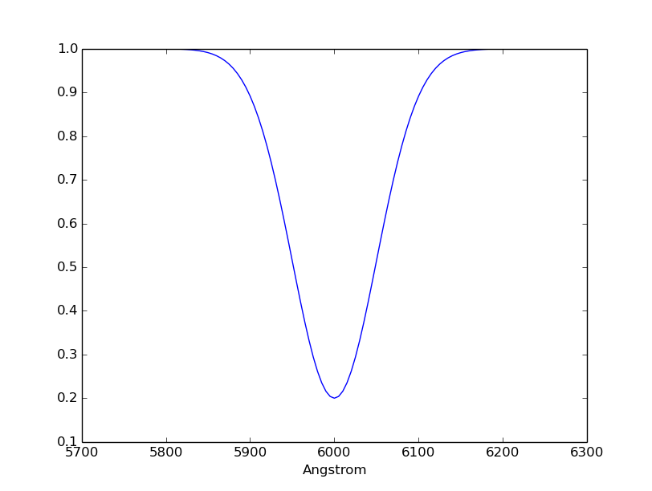
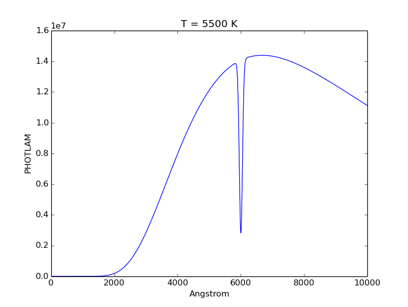

.. doctest-skip-all

.. _synphot_thermal:

Thermal Spectrum
================

A `~synphot.thermal.ThermalSpectralElement` is for handling thermal background,
which is important in IR observations. It has similar properties and methods as
a unitless spectrum (`~synphot.spectrum.BaseUnitlessSpectrum`), except that it
also has temperature and beam filling factor.

Its most notable method is
:func:`~synphot.thermal.ThermalSpectralElement.thermal_source`, which produces
a thermal (blackbody) source spectrum.

Examples
--------

Create a thermal spectral element with a temperature of 5500 K, default beam
filling factor, and gaussian absorption model:

>>> from synphot import ThermalSpectralElement
>>> from synphot.models import GaussianAbsorption1D
>>> th = ThermalSpectralElement(
...     GaussianAbsorption1D, temperature=5500,
...     amplitude=0.8, mean=6000, stddev=50)
>>> th.temperature
<Quantity 5500.0 K>
>>> th.beam_fill_factor
1.0
>>> th.plot()

Create a thermal source spectrum from the thermal spectral element above:

>>> th_sp = th.thermal_source()
>>> th_sp.plot(right=10000, title='T = 5500 K')

