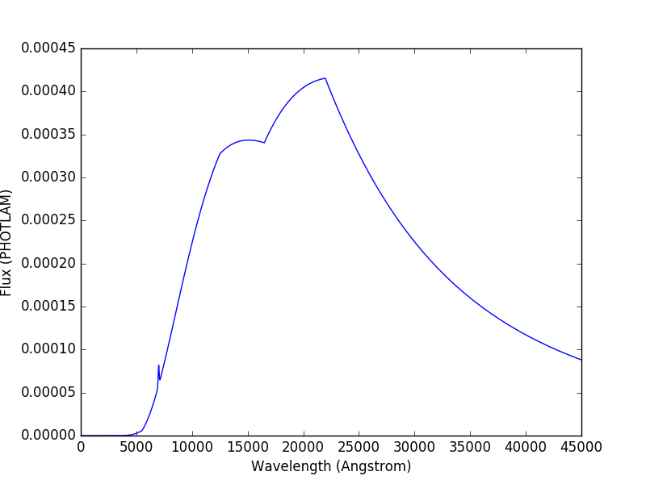
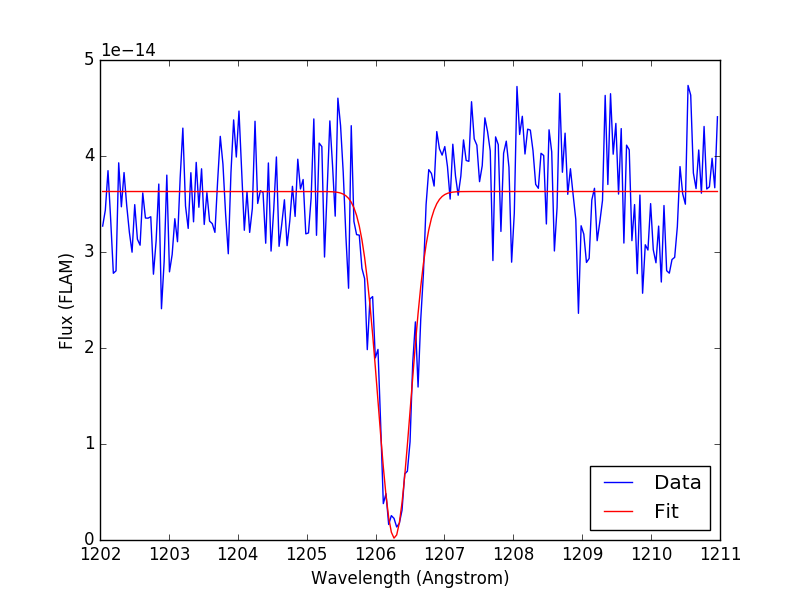

.. doctest-skip-all

.. _synphot-tutorials:

Tutorials
=========

This page contains tutorials of specific **synphot** functionality not
explicitly covered in other sections.

.. _tutorial_em_line:

Emission Line
-------------

This tutorial is adapted from
`Exposure Time Calculator User's Guide on a similar topic <http://etc.stsci.edu/etcstatic/users_guide/1_ref_8.5_emlines.html#using-synphot-to-modify-emission-lines>`_.
In this tutorial, you will learn how to manipulate and superimpose
an emission line to a continuum spectrum.

Create a continuum spectrum of a 5500 K blackbody with z=0.6::

    >>> from synphot import SourceSpectrum
    >>> from synphot.models import BlackBodyNorm1D
    >>> bb = SourceSpectrum(BlackBodyNorm1D, temperature=5500, z=0.6)

Create a Gaussian emission line with 8E-14 FLAM total flux,
FWHM of 100 Angstrom, and centered at 7000 Angstrom::

    >>> from synphot import units
    >>> from synphot.models import GaussianFlux1D
    >>> em = SourceSpectrum(
    ...     GaussianFlux1D, total_flux=8e-14*u.erg/(u.cm**2 * u.s),
    ...     fwhm=100, mean=7000)

Add emission line to continuum spectrum::

    >>> sp = bb + em

Apply extinction curve for LMC (average) with E(B-V)=1.3
to the composite spectrum::

    >>> from synphot import ReddeningLaw
    >>> ext = ReddeningLaw.from_extinction_model(
    ...     'lmcavg').extinction_curve(1.3)
    >>> my_spec = sp * ext

Plot the result::

    >>> my_spec.plot(right=45000)

.. _tutorial_continuum_norm:

Continuum-Normalized Spectrum
-----------------------------

In this tutorial, you will learn how to create a composite spectrum with a
noisy blackbody continuum, an emission line, and an absorption line.
Then, you will divide it by a smooth continuum and plot the resultant
continuum-normalized spectrum.

.. plot::
    :include-source:

    import matplotlib.pyplot as plt
    import numpy as np
    from synphot import SourceSpectrum, BaseUnitlessSpectrum
    from synphot.models import BlackBodyNorm1D, Empirical1D, GaussianFlux1D
    np.random.seed(1234)  # For reproducibility
    # Create the smooth continuum that is a 5000 K blackbody.
    bb = SourceSpectrum(BlackBodyNorm1D, temperature=5000)
    # Then, add random noise to it. Since synphot spectrum object cannot
    # be multiplied with scalar array, this has to be done indirectly by
    # applying the noise as a unitless spectrum.
    wave = np.arange(100, 30001, 10)
    nse = 1 + np.random.normal(size=wave.size, scale=0.02)
    sp_nse = BaseUnitlessSpectrum(Empirical1D, points=wave, lookup_table=nse)
    bb_noisy = bb * sp_nse
    # Apply emission and absorption lines to the noisy continuum.
    tf_unit = u.erg / (u.cm**2 * u.s)
    g_em = SourceSpectrum(
        GaussianFlux1D, total_flux=2.65e-14*tf_unit, mean=15000, fwhm=500)
    g_ab = SourceSpectrum(
        GaussianFlux1D, total_flux=6.62e-14*tf_unit, mean=4500, fwhm=100)
    sp = bb_noisy + g_em - g_ab
    # Divide the noisy spectrum with lines with the original smooth continuum
    # to obtain the continuum-normalized spectrum.
    ratio = sp / bb
    with np.errstate(invalid='ignore'):
        ratio.plot(left=2500, right=17000,
                   title='Continuum-normalized spectrum')
    plt.axhline(1, ls='--', color='k')

.. _tutorial_fit_ew:

Fitting, Equivalent Width
-------------------------

In this tutorial, you will learn how to fit a Gaussian model to some real
data and calculate its equivalent width. This is not handled by **synphot** but
it is included here for those who are interested to see how fitting in IRAF
SYNPHOT is done in Python. See :ref:`astropy:astropy-modeling` for more
information about fitting a model.

Read in the real data. If your own data has a different format, you need to
adjust the example accordingly::

    >>> from astropy.io import fits
    >>> with fits.open('/path/to/combined_13330_G130M_v40_bin4.fits') as pf:
    ...     dat = pf[1].data
    ...     wave = dat.field('WAVELENGTH').flatten()  # Angstrom
    ...     flux = dat.field('FLUX').flatten()  # FLAM

For a good fit, only use data around the feature of interest. In this example,
the feature is between 1202 and 1211 Angstrom::

    >>> mask = (wave >= 1202) & (wave <= 1211)
    >>> x = wave[mask]
    >>> y = flux[mask]

Create a composite model with some initial parameters close to the desired
result (usually sufficient to guess from looking at a plot of the data) and
fit it using some fitter that is best for the data (sometimes, several
iterations are required for a good fit)::

    >>> from astropy.modeling import models, fitting
    >>> bg = models.Const1D(amplitude=3.5E-14)
    >>> gs = models.Gaussian1D(amplitude=3.5E-14, mean=1206, stddev=1)
    >>> init_model = bg - gs
    >>> fitter = fitting.LevMarLSQFitter()
    >>> fit_model = fitter(init_model, x, y)
    >>> y_fit = fit_model(x)
    >>> print(fit_model)
    Model: CompoundModel1
    Inputs: ('x',)
    Outputs: ('y',)
    Model set size: 1
    Expression: [0] - [1]
    Components:
        [0]: <Const1D(amplitude=3.5e-14)>

        [1]: <Gaussian1D(amplitude=3.5e-14, mean=1206.0, stddev=1.0)>
    Parameters:
           amplitude_0       amplitude_1        mean_1       stddev_1
        ----------------- ----------------- ------------- -------------
        3.63064137361e-14 3.62623007738e-14 1206.27454371 0.23713207018

Plot the fitted model on top of input data::

    >>> import matplotlib.pyplot as plt
    >>> from matplotlib import ticker
    >>> fig, ax = plt.subplots()
    >>> ax.plot(x, y, 'b', x, y_fit, 'r')
    >>> ax.get_xaxis().set_major_formatter(
    ...     ticker.FuncFormatter(ticker.FormatStrFormatter('%.0f')))
    >>> ax.set_xlabel('Wavelength (Angstrom)')
    >>> ax.set_ylabel('Flux (FLAM)')
    >>> ax.legend(['Data', 'Fit'], loc='lower right')

Calculate equivalent width using the fitted model::

    >>> import math
    >>> area = (math.sqrt(2 * math.pi) * fit_model.amplitude_1 *
    ...     fit_model.stddev_1)  # Area under curve
    >>> height = fit_model.amplitude_0  # Continuum level
    >>> print('EW = {:.4f} Angstrom'.format(area / height))
    EW = 0.5937 Angstrom

.. _tutorial_lyman_alpha:

Lyman-Alpha Extinction
----------------------

In this tutorial, you will learn how to apply extinction curve due to
Lyman-alpha forest (:ref:`Madau et al. 1995 <synphot-ref-madau1995>`) to
a source spectrum. For clarity, we will only use a flat source.

.. plot::
    :include-source:

    import matplotlib.pyplot as plt
    from synphot import SourceSpectrum, etau_madau
    from synphot.models import ConstFlux1D
    # Create a flat source
    sp = SourceSpectrum(ConstFlux1D, amplitude=1E-4)
    # Apply extinction for a given redshift
    z = 2
    wave = range(2400, 4200)  # Angstrom
    extcurve = etau_madau(wave, z)
    sp_ext = sp * extcurve
    # Compare the source with and without extinction
    plt.plot(wave, sp(wave), 'b--', wave, sp_ext(wave), 'r')
    plt.xlabel('Wavelength (Angstrom)')
    plt.ylabel('Flux (PHOTLAM)')
    plt.legend(['Original', 'Extincted'], loc='lower right')

The chart below illustrates the Madau 1995 extinction curves for different
redshift values. For clarity, they are plotted against rest wavelength, not the
redshifted wavelength:

.. plot::
    :include-source:

    import matplotlib.pyplot as plt
    import numpy as np
    from synphot import etau_madau
    w_rest = np.arange(800, 1400)
    lc = ['k', 'navy', 'b', 'deepskyblue', 'mediumseagreen',
          'lightgreen', 'y', 'orange', 'r']
    for z in range(0, 9):
        wave = w_rest * (1 + z)
        extcurve = etau_madau(wave, z)
        plt.plot(w_rest, extcurve(wave), color=lc[z], label='z={}'.format(z))
    plt.ylim(0, 1.1)
    plt.xlabel('Rest-Frame Wavelength (Angstrom)')
    plt.ylabel('Lyman-alpha Forest "Throughput"')
    plt.legend(loc='center right')
    plt.grid()
